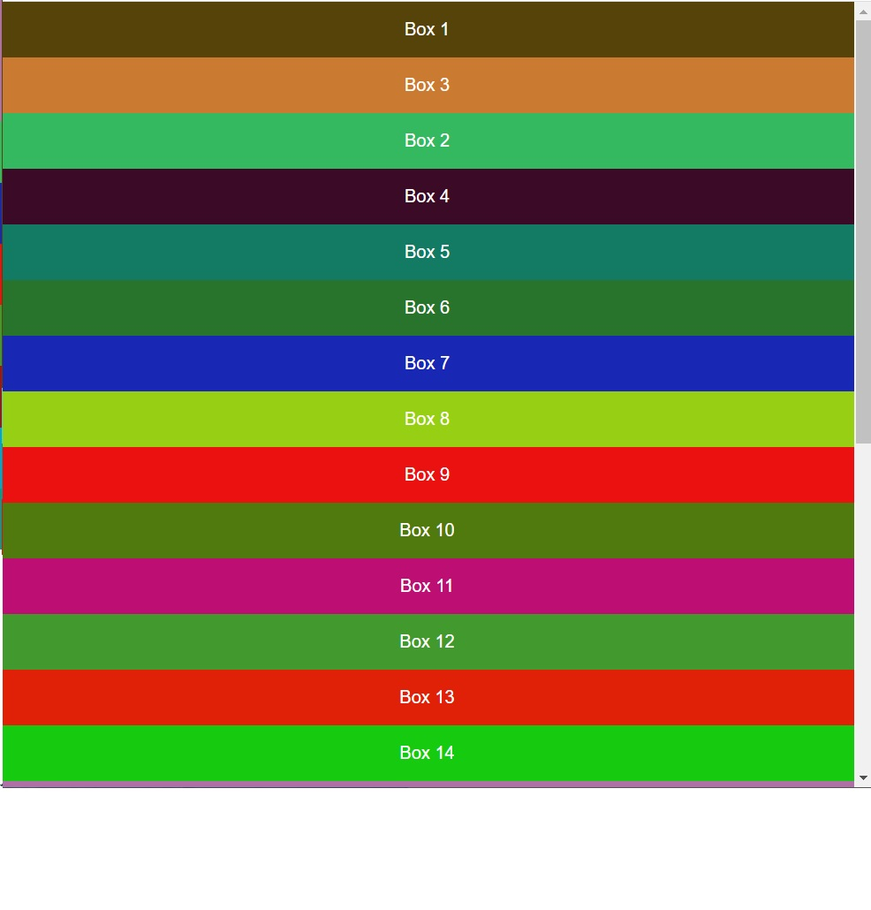
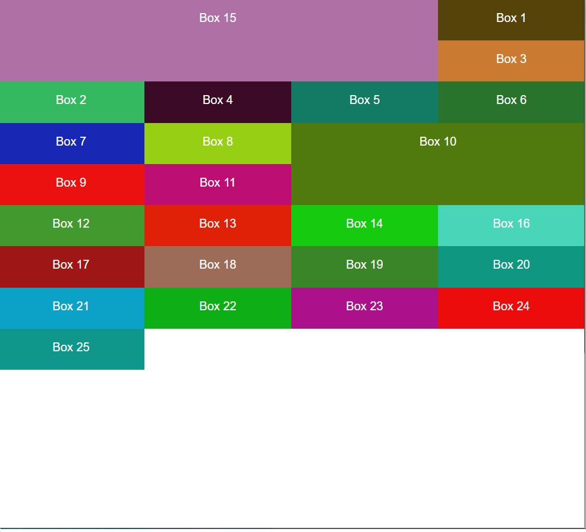
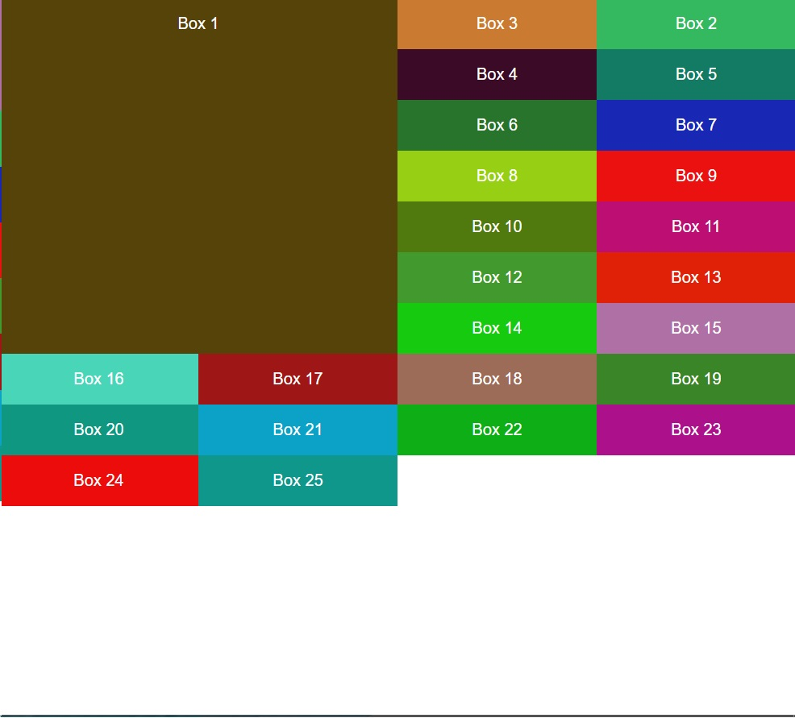

# Guide for Grid Css

# 00 - grid template

# 01 - grid template

# 02 - Positioning

# 03 - Span

# 04 - Using FR measure

# 05 - Using Repeat

# 06 - Using Gap

# 07 - Project Sample

# 08 - Project using template areas
